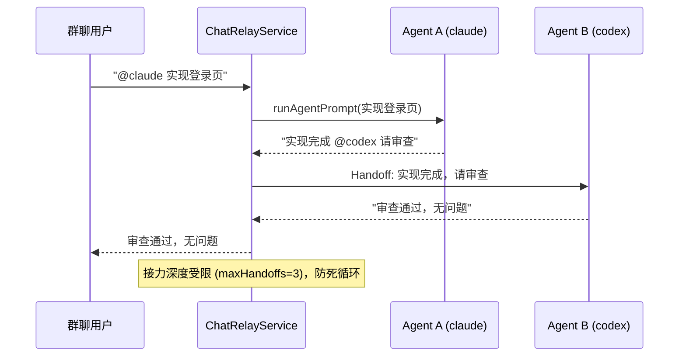

# MindApex — OpenWork 增强版：多 Agent 团队自动化平台

> **Fork 声明**：MindApex 是基于 [different-ai/openwork](https://github.com/different-ai/openwork) 的开源增强分支。我们在 OpenWork 的基础上做了持续升级：接入 60+ 主流 CLI Code Agent、构建 team-autonomy 团队自治层、自建 SSO 控制平面，把 OpenWork 从「技能/工作流共享桌面应用」演进为「多 Agent 团队自动化平台」。

OpenWork 是一个免费开源的桌面应用，用于共享 AI 工作流（skills / MCP / 连接的服务），是 Claude Cowork 与 Codex 的开源替代品。MindApex 保留了它的全部能力，并在此基础上增加了**团队自治（team-autonomy）**与**多 CLI Agent 接入**两层能力。

## 我们是什么

MindApex 是面向「AI Agent 团队」的自动化平台，回答三个问题：

1. **你的机器上有哪些 Agent 引擎？** —— 自动探测 PATH 上的全部 CLI Code Agent（Claude Code / Codex / Gemini CLI / Qwen Code / Kimi / Freebuff / Cursor / OpenCode 等 60+），上报能力矩阵（headless / 结构化输出 / ACP / PTY）。
2. **多个 Agent 如何并行协作不互相干扰？** —— 每个任务独立分支 + 独立目录（git worktree），完成后自动回收；Chat 群里 `@agentId` 即可驱动 agent 干活，agent 回复里 `@otherAgent` 自动接力（A 实现 → B 审查）。
3. **团队如何自治？** —— 任务依赖图、审批、预算、自动化的完整闭环，全部跑在**你自己的 SSO 控制平面**（better-auth + self-hosted den-api）上，不依赖 OpenWork Cloud。

## 原理

### 架构总览

```mermaid
flowchart TB
    subgraph Client["桌面客户端（Electron）"]
        UI[OpenWork UI]
    end

    subgraph Control["控制平面（自建 den-api + better-auth SSO）"]
        SSO[SSO / 会话]
        TEAM[TeamAgentService<br/>任务依赖图 / 审批 / 预算 / 自动化]
    end

    subgraph Runtime["本地 Runtime（OpenWork server）"]
        REG[RuntimeRegistry<br/>能力上报 · TTL 缓存]
        WT[WorktreeService<br/>任务隔离 · 自动回收]
        RELAY[ChatRelayService<br/>@mention 路由 · 多 Agent 接力]
        ADAPTER[GenericCliSidecarAdapter<br/>L2 headless / L1 PTY]
        SIDECAR[Sidecar 适配层<br/>ACP / PTY / MCP / Generic]
    end

    subgraph Agents["60+ CLI Code Agents"]
        CC[Claude Code]
        CX[Codex]
        GM[Gemini CLI]
        QW[Qwen Code]
        KM[Kimi]
        FB[Freebuff]
        OTHER[更多…]
    end

    UI --> SSO
    UI --> REG
    UI --> WT
    UI --> RELAY
    Control --> REG
    Control --> TEAM
    TEAM --> ADAPTER
    RELAY --> ADAPTER
    ADAPTER --> SIDECAR
    SIDECAR --> CC & CX & GM & QW & KM & FB & OTHER
```

### 多 Agent 接力原理（Chat Bridge）



### 与上游 OpenWork 的差异

| 维度 | OpenWork（上游） | MindApex（我们的增强） |
|---|---|---|
| Agent 引擎 | 仅 opencode sidecar | **60+ CLI Code Agents**（Claude Code / Codex / Gemini / Qwen / Kimi / Freebuff / Cursor…） |
| CLI Agent 驱动 | 交互式 PTY 盲写 | **L2 headless 输出解析**（`claude -p` / `codex exec` / `gemini -p`）+ 能力探测 + fail-fast |
| 任务隔离 | cwd 切换 | **git worktree 生命周期**（独立分支 + 独立目录 + 闲置自动回收） |
| Agent 调用入口 | UI / API | **Chat 桥接**（群聊 @mention 驱动 + 多 Agent 接力） |
| Runtime 能力 | 无上报 | **RuntimeRegistry**（机器上可用 Agent 引擎自动探测与上报） |
| 控制平面 | OpenWork Cloud | **自建 SSO**（better-auth + self-hosted den-api），不依赖云 |
| 团队自治 | — | TaskService / AutomationService / SkillValidationService / Permission+Inbox 完整闭环 |

## 核心特性

- **60+ CLI Agent 统一接入**：headless 优先、PTY 兜底、ACP 结构化，全部走统一 `AgentSidecarAdapter` 接口
- **fail-fast 原则**：不支持的 Agent 显式失败，绝不假成功
- **多 Agent 并行**：worktree 物理隔离，互不干扰；闲置自动回收
- **群聊驱动**：把 AI Agent 桥接到任意聊天通道，`@agentId` 驱动干活，`@otherAgent` 自动接力
- **团队自治闭环**：任务依赖图、Plan 审批、预算、自动化重试/降级/告警
- **自建 SSO**：better-auth，桌面客户端直接指向自建 den-api

## Install with your AI agent

继承自 OpenWork：把下面这段粘贴进 Claude Code / Cursor / Codex / 任何能执行命令的 Agent。

```text
Install OpenWork on my computer, set up my first workspace, and open it ready to use. Follow the steps in https://openworklabs.com/start.md?v=hero
```

1. 安装 OpenWork
2. 创建你的 workspace
3. 打开即可运行

## Use OpenWork from any agent

继承自 OpenWork：OpenWork MCP 把 skills / plugins / MCP 连接 / Google Workspace / Microsoft 365 能力带入任何兼容 Agent。它暴露两个工具：`search_capabilities` 查找可用能力，`execute_capability` 执行能力。

### Codex

```bash
codex mcp add openwork --url https://api.openworklabs.com/mcp/agent
```

### Claude Code

```bash
claude mcp add --transport http openwork https://api.openworklabs.com/mcp/agent
```

### OpenCode

Add this to `opencode.json`:

```json
{
  "mcp": {
    "openwork": {
      "type": "remote",
      "enabled": true,
      "url": "https://api.openworklabs.com/mcp/agent",
      "oauth": {}
    }
  }
}
```

## OpenWork Den（控制平面）

MindApex 将其扩展为**自建控制平面**（self-hosted den-api + better-auth SSO）：

- Provision inference at scale 并控制每个成员/团队可用的模型提供商
- 邀请成员、创建团队、一处管理访问权限
- 设置桌面策略、限制本地模型访问、控制组织可用的应用版本
- 通过 marketplace 发布 skills / plugins，分配给组织 / 团队 / 个人
- 导入 Anthropic 兼容插件，通过 OpenWork MCP 提供其 skills 与远程 MCP

## Local development

沿用 OpenWork 的开发方式：单 checkout 直接 `pnpm dev`；多 worktree 并行开发用 `pnpm dev:worktree`。

```bash
pnpm dev                 # 单个 checkout，复用共享 dev profile
pnpm dev:worktree        # 多 git worktree 并行（OPENWORK_DEV_PROFILE=auto）
```

`dev:worktree` 自动设置 `OPENWORK_ELECTRON_USE_MOCK_KEYCHAIN=1`（隔离 profile 下避免 macOS 真实 keychain 弹窗阻塞 Electron 主循环）。启动横幅形如 `[openwork] dev profile=... cdp=http://127.0.0.1:9223`。

## Documentation

- [OpenWork docs](https://openworklabs.com/docs)（继承）
- OpenSpecs（团队自治设计规范）：`prds/team-autonomy/openspecs/`（openspec-cli-agent-adapter / openspec-runtime-reporting / openspec-worktree-service / openspec-chat-bridge 等）

## License

本项目继承 OpenWork 的开源许可。上游：https://github.com/different-ai/openwork
