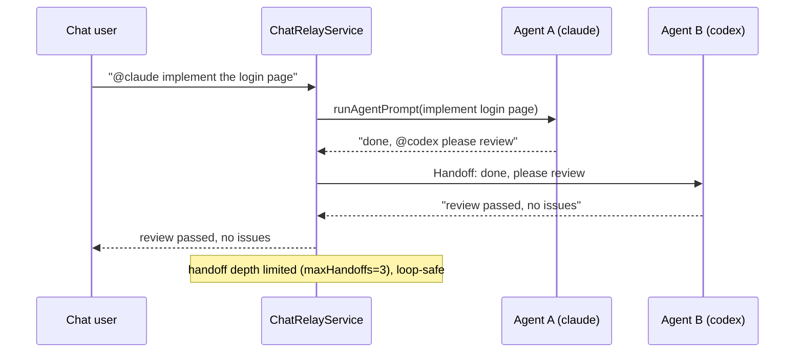

# OpenWork — Multi-Agent Team Automation Platform

> **Fork Notice**: This repository is an enhanced fork of [different-ai/openwork](https://github.com/different-ai/openwork). We keep all of OpenWork's capabilities and add support for 60+ CLI Code Agents, a team-autonomy layer, and a self-hosted SSO control plane.
>
> 🌐 [简体中文](README.zh-CN.md)

OpenWork is a free, open-source desktop app made for sharing AI workflows. It is an open-source alternative to Claude Cowork and Codex for macOS, Windows, and Linux. Add one OpenWork MCP to Codex, Claude Code, Cursor, or another compatible agent and reuse the same skills, MCPs, and connected services across your tools, teammates, and machines.

This fork inherits all of the above and adds two layers on top: **multi-agent access** (60+ CLI Code Agents) and **team autonomy** — evolving OpenWork from a "skill/workflow sharing app" into a "multi-agent team automation platform".

---

## What We Are

A **multi-agent team automation platform** — it answers three questions:

1. **What agent engines exist on this machine?** — auto-detect every CLI Code Agent on PATH (Claude Code / Codex / Gemini CLI / Qwen Code / Kimi / Freebuff / Cursor / OpenCode, 60+ total) and report a capability matrix (headless / structured output / ACP / PTY).
2. **How do multiple agents work in parallel without interfering?** — each task runs in its own git worktree (independent branch + directory), reclaimed automatically when done; in Chat, `@agentId` drives an agent and `@otherAgent` in a reply hands off automatically (A implements → B reviews).
3. **How does the team stay autonomous?** — task dependency graph, approvals, budgets, and automation run as a closed loop on **your own SSO control plane** (better-auth + self-hosted den-api), no OpenWork Cloud dependency.

---

## Differences from Upstream & Problems Solved

### Comparison

| Dimension | Upstream OpenWork | This Fork |
|---|---|---|
| Agent engines | opencode sidecar only | **60+ CLI Code Agents** (Claude Code / Codex / Gemini / Qwen / Kimi / Freebuff / Cursor…) |
| Driving CLI agents | interactive PTY, blind stdin | **L2 headless output parsing** (`claude -p` / `codex exec` / `gemini -p`) + capability probing + **fail-fast** |
| Task isolation | single cwd, no isolation | **git worktree lifecycle**: independent branch + directory, idle auto-reclamation |
| Agent entry point | manual UI / API | **Chat bridge**: `@mention` driving + multi-agent handoff (maxHandoffs=3, loop-safe) |
| Runtime capability | none | **RuntimeRegistry**: auto-detect installed agent engines, TTL cache, deep capability probe |
| Control plane | OpenWork Cloud (cloud dependency) | **Self-hosted SSO**: better-auth + self-hosted den-api |
| Team autonomy | — | TaskService / AutomationService / SkillValidationService / Permission+Inbox closed loop |

### Problems We Solved

1. **Only opencode could be driven; other mainstream CLI agents were not supported.** Upstream only ships an opencode sidecar; other Code Agents (Claude Code / Codex / Gemini / Kimi / Freebuff…) were either unsupported or required hand-written PTY glue. We implemented `GenericCliSidecarAdapter`, which drives agents by real capability (headless first, PTY fallback, ACP structured), so 60+ presets are each one declaration line.

2. **Agent failures were silently swallowed ("fake success").** Upstream wrote blindly to stdin for unsupported agents — the process started but the result never came back. We introduced the **fail-fast principle**: declaration/probe conflicts and missing binaries always throw explicitly (`CliAgentUnsupportedError`), never fake success.

3. **Parallel agents polluted each other's workspace.** Upstream switched cwd in one shared directory, so A's changes contaminated B. We introduced a **git worktree lifecycle service**: each task gets its own branch + directory, reclaimed on completion/failure, idle for 6h is auto-cleaned.

4. **Agents could only be triggered manually via UI.** We implemented a **Chat bridge layer**: in any chat channel, `@agentId` drives work, and `@otherAgent` in a reply hands off automatically (A implements → B reviews), with depth limits to prevent loops.

5. **No visibility into which agents were installed.** We implemented **RuntimeRegistry**: the daemon auto-detects CLI agents on PATH at startup and reports the capability matrix (TTL cache, per-entry fault tolerance), queryable by UI / control plane at any time.

6. **Dependency on OpenWork Cloud for auth and data.** We implemented **self-hosted SSO** (better-auth + self-hosted den-api); the desktop client points directly at your own control plane, so team data never leaves the intranet.

---

## How It Works

### Architecture

```mermaid
flowchart TB
    subgraph Client["Desktop Client (Electron)"]
        UI[OpenWork UI]
    end

    subgraph Control["Control Plane (den-api + better-auth SSO)"]
        SSO[SSO / Sessions]
        TEAM[TeamAgentService<br/>task graph / approvals / budgets / automation]
    end

    subgraph Runtime["Local Runtime (OpenWork server)"]
        REG[RuntimeRegistry<br/>capability report · TTL cache]
        WT[WorktreeService<br/>task isolation · auto-reclaim]
        RELAY[ChatRelayService<br/>@mention routing · multi-agent handoff]
        ADAPTER[GenericCliSidecarAdapter<br/>L2 headless / L1 PTY]
        SIDECAR[Sidecar adapters<br/>ACP / PTY / MCP / Generic]
    end

    subgraph Agents["60+ CLI Code Agents"]
        CC[Claude Code]
        CX[Codex]
        GM[Gemini CLI]
        QW[Qwen Code]
        KM[Kimi]
        FB[Freebuff]
        OTHER[more…]
    end

    UI --> SSO
    UI --> REG
    UI --> WT
    UI --> RELAY
    Control --> REG
    Control --> TEAM
    TEAM --> ADAPTER
    RELAY --> ADAPTER
    ADAPTER --> SIDECAR
    SIDECAR --> CC & CX & GM & QW & KM & FB & OTHER
```

### Multi-Agent Relay (Chat Bridge)



---

## Install with your AI agent

Copy this prompt and paste it into Claude Code, Cursor, Codex, ChatGPT, or any agent that can run commands on your computer.

```text
Install OpenWork on my computer, set up my first workspace, and open it ready to use. Follow the steps in https://openworklabs.com/start.md?v=hero
```

1. Installs OpenWork
2. Creates your workspace
3. Opens it ready to run

## Use OpenWork from any agent

The OpenWork MCP brings your assigned skills, plugins, MCP connections, Google Workspace, and Microsoft 365 capabilities into any compatible agent. It exposes two tools: `search_capabilities` finds what you can use, and `execute_capability` runs it.

### Codex

```bash
codex mcp add openwork --url https://api.openworklabs.com/mcp/agent
```

### Claude Code

```bash
claude mcp add --transport http openwork https://api.openworklabs.com/mcp/agent
```

### OpenCode

Add this to `opencode.json`:

```json
{
  "mcp": {
    "openwork": {
      "type": "remote",
      "enabled": true,
      "url": "https://api.openworklabs.com/mcp/agent",
      "oauth": {}
    }
  }
}
```

## OpenWork Den (Control Plane)

Inherited from OpenWork and extended into a **self-hosted control plane** (self-hosted den-api + better-auth SSO):

- Provision inference at scale and control which members and teams can use each model provider.
- Invite teammates, create teams, and manage access from one place.
- Set desktop policies, restrict local model access, and control which app versions your organization can use.
- Publish skills and plugins through marketplaces, then assign them to the organization, a team, or specific people.
- Import Anthropic-compatible plugins and make their supported skills and remote MCPs available through the OpenWork MCP.

## Local development

Follow the upstream workflow: single checkout uses `pnpm dev`; parallel worktrees use `pnpm dev:worktree`.

```bash
pnpm dev                 # single checkout, reuses the shared dev profile
pnpm dev:worktree        # multiple git worktrees (OPENWORK_DEV_PROFILE=auto)
```

`dev:worktree` also defaults `OPENWORK_ELECTRON_USE_MOCK_KEYCHAIN=1` (avoids macOS keychain prompts blocking Electron's main loop in isolated profiles). Dev startup prints a banner like `[openwork] dev profile=... cdp=http://127.0.0.1:9223`.

## Documentation

- [OpenWork docs](https://openworklabs.com/docs) (inherited)
- OpenSpecs (team-autonomy design specs): `prds/team-autonomy/openspecs/` (openspec-cli-agent-adapter / openspec-runtime-reporting / openspec-worktree-service / openspec-chat-bridge, etc.)

## License

This project inherits the OpenWork open-source license. Upstream: https://github.com/different-ai/openwork
