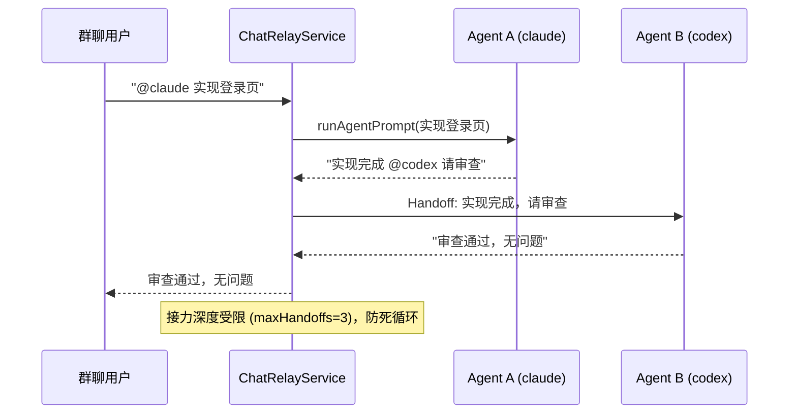

# OpenWork — 多 Agent 团队自动化平台

> **Fork 声明**：本仓库是 [different-ai/openwork](https://github.com/different-ai/openwork) 的开源增强分支（enhanced fork）。我们保留了 OpenWork 的全部能力，并在此基础上接入 60+ 主流 CLI Code Agent、构建 team-autonomy 团队自治层、自建 SSO 控制平面。
>
> 🌐 [English](README.md)

OpenWork 是一个免费开源的桌面应用，用于共享 AI 工作流（skills / MCP / 连接的服务），是 Claude Cowork 与 Codex 的开源替代品。把 OpenWork MCP 加到 Codex、Claude Code、Cursor 或其他兼容 agent，就能在工具、队友、机器之间复用同一套 skills、MCP 和连接的服务。

本分支在继承上述全部能力的基础上，增加了**多 Agent 接入**（60+ CLI Code Agent）与**团队自治（team-autonomy）**两层能力，把 OpenWork 从「技能/工作流共享应用」演进为「多 Agent 团队自动化平台」。

---

## 我们是什么

**多 Agent 团队自动化平台**，回答三个问题：

1. **这台机器上有哪些 Agent 引擎？** —— 自动探测 PATH 上的全部 CLI Code Agent（Claude Code / Codex / Gemini CLI / Qwen Code / Kimi / Freebuff / Cursor / OpenCode 等 60+），上报能力矩阵（headless / 结构化输出 / ACP / PTY）。
2. **多个 Agent 如何并行协作互不干扰？** —— 每个任务独立分支 + 独立目录（git worktree），完成后自动回收；群里 `@agentId` 驱动 agent，回复中 `@otherAgent` 自动接力（A 实现 → B 审查）。
3. **团队如何自治？** —— 任务依赖图、审批、预算、自动化的完整闭环，跑在**自建 SSO 控制平面**（better-auth + self-hosted den-api）上，不依赖 OpenWork Cloud。

---

## 与上游的差异和解决的问题

### 差异对照表

| 维度 | 上游 OpenWork | 本分支 |
|---|---|---|
| Agent 引擎 | 仅 opencode sidecar | **60+ CLI Code Agents**（Claude Code / Codex / Gemini / Qwen / Kimi / Freebuff / Cursor…） |
| CLI Agent 驱动 | 交互式 PTY 盲写 | **L2 headless 输出解析**（`claude -p` / `codex exec` / `gemini -p`）+ 能力探测 + **fail-fast** |
| 任务隔离 | 同一个 cwd 切换 | **git worktree 生命周期**：独立分支 + 独立目录 + 闲置自动回收 |
| Agent 调用入口 | 手动 UI / API | **Chat 桥接**：群聊 `@mention` 驱动 + 多 Agent 接力（maxHandoffs=3 防死循环） |
| Runtime 能力上报 | 无 | **RuntimeRegistry**：机器上可用 Agent 引擎自动探测、TTL 缓存、深度能力探测 |
| 控制平面 | OpenWork Cloud（依赖云） | **自建 SSO**：better-auth + self-hosted den-api |
| 团队自治 | — | TaskService / AutomationService / SkillValidationService / Permission+Inbox 完整闭环 |

### 解决的问题

1. **只能驱动 opencode，其他主流 CLI Agent 无法接入**
   上游仅内置 opencode sidecar；其他 Code Agent（Claude Code / Codex / Gemini / Kimi / Freebuff…）要么不支持、要么需要手工拼 PTY。我们实现了 `GenericCliSidecarAdapter`，按真实能力分层驱动（headless 优先、PTY 兜底、ACP 结构化），60+ presets 一条声明即可接入。

2. **Agent 调用失败被静默吞掉，出现「假成功」**
   上游对不支持的 agent 只是盲写 stdin，进程起来了却永远收不到结果。我们引入 **fail-fast 原则**：声明与实测冲突、二进制缺失一律显式抛错（`CliAgentUnsupportedError`），绝不假成功。

3. **多 Agent 并行互相污染工作区**
   上游只在同一个 cwd 切换目录，A 的改动会污染 B。我们引入 **git worktree 生命周期服务**：每个任务独立分支 + 独立目录，任务完成/失败后自动回收，闲置 6h 自动清理。

4. **Agent 只能通过 UI 手动点，无法群聊驱动**
   我们实现 **Chat 桥接层**：任何聊天通道里 `@agentId` 驱动干活，回复里 `@otherAgent` 自动接力（A 实现 → B 审查），深度受限防死循环。

5. **不知道机器上装了哪些 Agent**
   我们实现 **RuntimeRegistry**：daemon 启动时自动探测 PATH 上的可用 CLI Agents 并上报能力矩阵（TTL 缓存、逐条容错），UI / 控制平面随时可查。

6. **依赖 OpenWork Cloud，数据与认证上云**
   我们实现 **自建 SSO**（better-auth + self-hosted den-api），桌面客户端直接指向自己的控制平面，团队数据不出内网。

---

## 原理

### 架构总览

```mermaid
flowchart TB
    subgraph Client["桌面客户端 Electron"]
        UI[OpenWork UI]
    end

    subgraph Control["控制平面 (den-api + better-auth SSO)"]
        SSO[SSO / 会话]
        TEAM[TeamAgentService<br/>任务依赖图 / 审批 / 预算 / 自动化]
    end

    subgraph Runtime["本地 Runtime (OpenWork server)"]
        REG[RuntimeRegistry<br/>能力上报 · TTL 缓存]
        WT[WorktreeService<br/>任务隔离 · 自动回收]
        RELAY[ChatRelayService<br/>@mention 路由 · 多 Agent 接力]
        ADAPTER[GenericCliSidecarAdapter<br/>L2 headless / L1 PTY]
        SIDECAR[Sidecar 适配层<br/>ACP / PTY / MCP / Generic]
    end

    subgraph Agents["60+ CLI Code Agents"]
        CC[Claude Code]
        CX[Codex]
        GM[Gemini CLI]
        QW[Qwen Code]
        KM[Kimi]
        FB[Freebuff]
        OTHER[更多…]
    end

    UI --> SSO
    UI --> REG
    UI --> WT
    UI --> RELAY
    Control --> REG
    Control --> TEAM
    TEAM --> ADAPTER
    RELAY --> ADAPTER
    ADAPTER --> SIDECAR
    SIDECAR --> CC & CX & GM & QW & KM & FB & OTHER
```

### 多 Agent 接力（Chat Bridge）



---

## 安装（继承自 OpenWork）

把下面这段粘贴进 Claude Code / Cursor / Codex / ChatGPT / 任何能执行命令的 agent。

```text
Install OpenWork on my computer, set up my first workspace, and open it ready to use. Follow the steps in https://openworklabs.com/start.md?v=hero
```

1. 安装 OpenWork
2. 创建你的 workspace
3. 打开即可运行

## 从任意 agent 使用 OpenWork（继承自 OpenWork）

OpenWork MCP 把 skills / plugins / MCP 连接 / Google Workspace / Microsoft 365 能力带入任何兼容 agent。它暴露两个工具：`search_capabilities` 查找可用能力，`execute_capability` 执行能力。

### Codex

```bash
codex mcp add openwork --url https://api.openworklabs.com/mcp/agent
```

### Claude Code

```bash
claude mcp add --transport http openwork https://api.openworklabs.com/mcp/agent
```

### OpenCode

在 `opencode.json` 中加入：

```json
{
  "mcp": {
    "openwork": {
      "type": "remote",
      "enabled": true,
      "url": "https://api.openworklabs.com/mcp/agent",
      "oauth": {}
    }
  }
}
```

## OpenWork Den（控制平面）

继承 OpenWork 的 Den 能力，本分支将其扩展为**自建控制平面**（self-hosted den-api + better-auth SSO）：

- Provision inference at scale 并控制每个成员/团队可用的模型提供商
- 邀请成员、创建团队、一处管理访问权限
- 设置桌面策略、限制本地模型访问、控制组织可用的应用版本
- 通过 marketplace 发布 skills / plugins，分配给组织 / 团队 / 个人
- 导入 Anthropic 兼容插件，通过 OpenWork MCP 提供其 skills 与远程 MCP

## 本地开发

沿用 OpenWork 的开发方式：单 checkout 直接 `pnpm dev`；多 worktree 并行开发用 `pnpm dev:worktree`。

```bash
pnpm dev                 # 单个 checkout，复用共享 dev profile
pnpm dev:worktree        # 多 git worktree 并行（OPENWORK_DEV_PROFILE=auto）
```

`dev:worktree` 自动设置 `OPENWORK_ELECTRON_USE_MOCK_KEYCHAIN=1`（隔离 profile 下避免 macOS 真实 keychain 弹窗阻塞 Electron 主循环）。启动横幅形如 `[openwork] dev profile=... cdp=http://127.0.0.1:9223`。

## 文档

- [OpenWork docs](https://openworklabs.com/docs)（继承上游）
- OpenSpecs（本分支团队自治设计规范）：`prds/team-autonomy/openspecs/`（openspec-cli-agent-adapter / openspec-runtime-reporting / openspec-worktree-service / openspec-chat-bridge 等）

## License

本项目继承 OpenWork 的开源许可。上游：https://github.com/different-ai/openwork
